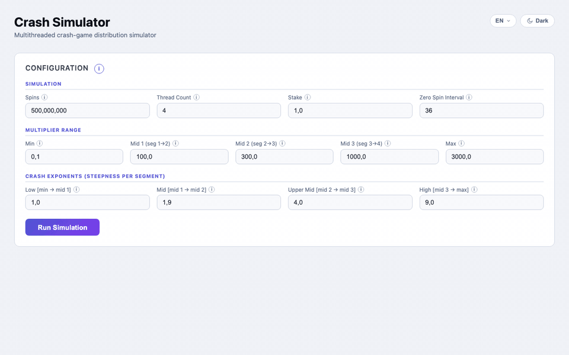

# Crash Game Simulator

A high-performance, multithreaded **crash-game distribution simulator** built with Spring Boot 3 and
vanilla JS. Runs up to 1 billion rounds across up to 8 parallel worker threads, streams per-thread
results live via Server-Sent Events, and renders global statistics in a responsive web UI.



---

## Table of Contents

1. [What It Does](#what-it-does)
2. [Architecture Overview](#architecture-overview)
3. [The Math: Pure Pareto Distribution](#the-math-pure-pareto-distribution)
4. [Cash-out Strategy Mode](#cash-out-strategy-mode)
5. [Concurrent Reduction Pattern](#concurrent-reduction-pattern)
6. [Volatility Statistics](#volatility-statistics)
7. [Median & P90 Estimation: Knuth Reservoir Sampling](#median--p90-estimation-knuth-reservoir-sampling)
8. [Package Structure](#package-structure)
9. [Class-by-Class Breakdown](#class-by-class-breakdown)
10. [Configuration Reference](#configuration-reference)
11. [HTTP API](#http-api)
12. [SSE Streaming Protocol](#sse-streaming-protocol)
13. [Frontend Architecture](#frontend-architecture)
14. [Internationalization (i18n)](#internationalization-i18n)
15. [Theming System](#theming-system)
16. [Running Locally](#running-locally)
17. [Performance Characteristics](#performance-characteristics)

---

## What It Does

The simulator models a **crash-style gambling game** where each round ("spin") produces a random
multiplier drawn from a pure Pareto distribution. The key questions it answers:

- What is the long-run **Return-to-Player (RTP)** for a given configuration?
- What is the **win rate** (fraction of rounds reaching the cash-out target)?
- What are the **mean, median, standard deviation, and volatility index** of the crash distribution?
- How fast does each **thread segment** complete, and how evenly is work distributed?
- How does a **multi-target cash-out strategy** (weighted mix of multipliers) affect RTP and win
  rate?

A single run of 50 million rounds at 4 threads completes in approximately **200–400 ms** on a modern
multicore machine.

---

## Architecture Overview

```
Browser
  │
  │  GET /                       → Thymeleaf form (config pre-filled from application.yml)
  │  GET /simulate/validate?...  → JSON validation result
  │  GET /simulate/stream?...    → SSE stream (text/event-stream)
  │
  ▼
SimulationController
  │
  ├── validate()   → SimulationValidator.validate(req) → 200 OK or 400 + errors[]
  │
  └── stream()     → SimulationService.run(req)
                         │
                         │  @Async — runs on Spring's task executor
                         │
                         ├── ExecutorService (N threads)
                         │       ├── WorkerThread(0, spins/N, req) ──► ReductionResult
                         │       ├── WorkerThread(1, spins/N, req) ──► ReductionResult
                         │       ├── ...
                         │       └── WorkerThread(N-1, spins/N±1, req) ──► ReductionResult
                         │
                         ├── future.get() × N  →  SSE event "thread" per completion
                         │
                         └── aggregate()       →  SSE event "complete" → emitter.complete()
```

The SSE transport means the browser receives thread results **as they finish**, not in a batch at
the end.

---

## The Math: Pure Pareto Distribution

Each round draws a crash multiplier from a **pure Pareto (power-law) distribution** over
`[1.0, multiplierMax]`.

### Inverse-CDF Sampling

Given `u ~ Uniform[0, 1)`, the crash point is computed in O(1) — one division + one min:

```
x = min(multiplierMax, 1 / (1 − u))
```

This is the inverse CDF of the Pareto distribution with shape α = 1 and scale 1.0.

### Survival Function

```
S(x) = P(crash ≥ x) = 1 / x
```

This means: the probability of the crash point reaching at least `x×` is exactly `1/x`. For example:

- P(crash ≥ 2×) = 50%
- P(crash ≥ 10×) = 10%
- P(crash ≥ 100×) = 1%

### 100% Theoretical RTP

For any cash-out multiplier `c`:

```
E[payout per spin] = c × P(crash ≥ c) = c × (1/c) = 1.0
```

The expected payout always equals the stake — **exactly 100% theoretical RTP** regardless of the
cash-out target, when instant crashes are disabled.

### Instant Crash Effect

When `instantCrashInterval = N > 0`, every Nth round force-crashes at 1.0× (below the minimum valid
cash-out of 1.01×). Each such forced crash reduces effective RTP by `1/N × 100%`. At the default
interval of 44, effective RTP ≈ 97.7%.

### Theoretical Properties

| Property                         | Value               |
|----------------------------------|---------------------|
| Median                           | 2.0×                |
| Mean                             | ln(multiplierMax)   |
| P(crash ≥ 2×)                    | 50%                 |
| P90                              | 10.0×               |
| Volatility Index (VI = P90/P50)  | ≈ 5.0 (Medium band) |
| RTP (instant crash interval = 0) | 100%                |

---

## Cash-out Strategy Mode

Beyond a single fixed multiplier, the simulator supports a **weighted multi-target strategy**:

- Define a list of multipliers and a corresponding list of percentage weights (must sum to 100).
- Each round independently draws a random cash-out target from the list using those weights.
- Win condition and payout both use the randomly selected target for that round.

**Example:** weights `33.3, 33.3, 33.4` / multipliers `2.0, 3.5, 50.0` — each target has roughly
equal probability per round.

### Implementation

`WorkerThread` builds a **cumulative probability array** from the weights at construction time. Each
spin uses a **binary search** (O(log k)) on the cumulative array to pick the target, making strategy
mode negligibly slower than single-target mode even at billions of rounds.

`SimulationService` computes the **weighted-average effective multiplier** (
`Σ weight_i × mult_i / Σ weight_i`) for display purposes in the global results.

---

## Concurrent Reduction Pattern

The simulation uses a classic **fork-join parallel reduction**:

1. **Fork** — `N` independent `WorkerThread` tasks are submitted to a fixed-thread-pool
   `ExecutorService`. Each thread gets `⌊totalSpins / N⌋` rounds; the first `totalSpins % N` threads
   get one extra round, ensuring exact total.

2. **Compute** — each thread runs its spin loop locally, accumulating: `totalStaked`,
   `totalReturned`, `wins`, `localMax`, `sumCrashMultiplier`, `sumSquaredCrash`, a `MedianTracker`
   reservoir, and a log-uniform histogram of 40 buckets. Zero shared state — no synchronization
   overhead.

3. **Join** — the orchestrator calls `future.get()` sequentially. As each `ReductionResult` arrives
   it is merged into global accumulators:
    - **Summation**: `grandStaked`, `grandReturned`, `totalWins`
    - **Max**: `globalMax = max(globalMax, r.maxMultiplier())`
    - **Weighted mean**: `sumAvgCrash += r.avgCrashMultiplier() * r.spins()`
    - **Variance accumulation**: `sumSquaredCrash += r.sumSquaredCrash()`
    - **Arithmetic mean of per-thread medians**: `sumMedians += r.medianCrashMultiplier()`
    - **Arithmetic mean of per-thread P90s**: `sumP90s += r.p90CrashMultiplier()`
    - **Histogram merge**: element-wise sum across all thread histograms

4. Each `ReductionResult` is immediately serialized and pushed as an SSE `"thread"` event.

5. After all futures: global statistics are computed and pushed as a `"complete"` SSE event.

---

## Volatility Statistics

### Standard Deviation

Computed via a **one-pass online algorithm** using `Σx` and `Σx²`:

```
μ = Σx / N
σ² = Σx² / N − μ²     (population variance)
σ = √(max(0, σ²))     (std dev; max guards against floating-point negatives)
```

Each `WorkerThread` accumulates `sumSquaredCrash` (= `Σ(crashPoint²)`). These are summed across
threads during the join phase before applying the formula.

### Volatility Index

The **Volatility Index (VI)** is the **P90 / P50 ratio** of the crash-point distribution. It
measures how fat the tail is relative to the typical outcome — independent of the mean or stake
size.

For pure Pareto: P50 = 2.0× and P90 = 10.0×, giving **VI ≈ 5.0** — always Medium.

| Band    | VI Range   |
|---------|------------|
| Low     | < 3.0      |
| Medium  | 3.0 – 6.0  |
| High    | 6.0 – 12.0 |
| Extreme | > 12.0     |

---

## Median & P90 Estimation: Knuth Reservoir Sampling

Computing an exact median or P90 from 50+ million doubles would require sorting all values (O(n log
n), ~400 MB per thread at 50M spins). Instead, `MedianTracker` implements **Algorithm R** from
Knuth's *The Art of Computer Programming*, Vol. 2.

### Algorithm

```
count = 0
reservoir[0..k-1]   (k = 100,000)

for each value v:
    count++
    if count ≤ k:
        reservoir[count - 1] = v          // fill phase
    else:
        j = random integer in [0, count)
        if j < k:
            reservoir[j] = v              // replace phase
```

After the spin loop, the reservoir is sorted and the desired quantile is read off by index.

### Why It Works

At any point after the fill phase, each of the `count` values seen so far has **exactly `k / count`
** probability of occupying a slot in the reservoir — uniform sampling with no bias toward early or
late values.

### Resource Usage

| Property                    | Value                                            |
|-----------------------------|--------------------------------------------------|
| Memory per thread           | `100,000 × 8 bytes = 800 KB`                     |
| Time per spin               | O(1) amortized — 1 RNG call, 1 conditional write |
| Quantile error at 50M spins | < 0.1%                                           |

---

## Package Structure

```
src/main/java/com/crash/
├── CrashSimulator.java               Entry point — @SpringBootApplication + @EnableAsync
│
├── model/
│   ├── SimulationConfig.java         @ConfigurationProperties("slot") — default values from application.yml
│   ├── SimulationResult.java         Record — global aggregated result sent in SSE "complete" event
│   └── ReductionResult.java          Record — per-thread result sent in SSE "thread" event
│
├── web/
│   ├── SimulationController.java     HTTP layer: GET /, GET /simulate/validate, GET /simulate/stream
│   ├── SimulationRequest.java        DTO — 8 parameters bound from query string
│   └── SimulationValidator.java      Pure-static server-side validation with detailed error messages
│
├── service/
│   └── SimulationService.java        Orchestrator — @Async executor, fork-join, SSE emission
│
├── simulation/
│   ├── WorkerThread.java             Callable<ReductionResult> — the hot spin loop
│   └── MultiplierDistribution.java   Pure Pareto inverse-CDF: x = min(max, 1/(1−u)), O(1) per spin
│
└── stats/
    └── MedianTracker.java            Knuth Algorithm R reservoir sampler, O(k) memory
```

---

## Class-by-Class Breakdown

### `CrashSimulator`

Spring Boot entry point. `@EnableAsync` activates Spring's async task executor, required for
`SimulationService.runAsync()` to return immediately to the HTTP thread.

### `SimulationConfig`

A Lombok `@Data` class annotated with `@ConfigurationProperties(prefix = "slot")`. Spring Boot
auto-binds the 6 simulation parameters from the `slot:` block in `application.yml` at startup.
Injected into `SimulationController` to pre-populate the HTML form.

### `SimulationRequest`

A Lombok `@Data` DTO with 8 fields (6 simulation params + `strategyWeights` +`strategyMultipliers`).
Spring MVC binds query parameters via `@ModelAttribute`. Kept separate from`SimulationConfig` to
avoid mutating application-level defaults.

### `SimulationValidator`

Stateless utility class with a single public method `validate(SimulationRequest)` returning a
`List<String>` of error messages. Validates:

- **Spins**: 1–1,000,000,000
- **Thread count**: 1–8
- **Stake**: 0.1–200.0, divisible by 0.1
- **Instant crash interval**: ≥ 0
- **Max multiplier**: 10–100,000, divisible by 0.1, > cash-out (or > max strategy multiplier)
- **Single mode**: cash-out ≥ 1.01, divisible by 0.01, < multiplierMax
- **Strategy mode**: ≥ 2 entries, all weights > 0, sum = 100 ±0.001, all multipliers ≥ 1.01,
  divisible by 0.01, < multiplierMax

### `SimulationController`

Three endpoints:

| Method | Path                 | Role                                                               |
|--------|----------------------|--------------------------------------------------------------------|
| `GET`  | `/`                  | Renders Thymeleaf template with `SimulationConfig` model attribute |
| `GET`  | `/simulate/validate` | Returns `{"valid":true}` or `{"valid":false,"errors":[...]}`       |
| `GET`  | `/simulate/stream`   | Returns `SseEmitter` — opens SSE stream, fires async simulation    |

The validate and stream endpoints are separated to avoid a Spring MVC conflict: `SseEmitter` does
not compose with `ResponseEntity`, causing `getOutputStream() already called` exceptions if mixed.

### `SimulationService`

The core orchestrator. `run()` creates a zero-timeout `SseEmitter` and delegates to `runAsync()`
annotated `@Async`.

Inside `runAsync()`:

1. Creates `Executors.newFixedThreadPool(N)` via try-with-resources.
2. Distributes rounds: each thread gets `spins/N`; first `spins%N` threads get one extra.
3. Submits `WorkerThread` callables, collects `Future<ReductionResult>`.
4. For each future: calls `future.get()`, accumulates global stats, emits a `"thread"` SSE event.
5. Computes final statistics (std dev, volatility index, effective cash-out, merged histogram),
   emits `"complete"` SSE event.

### `WorkerThread`

The hot path. Implements `Callable<ReductionResult>`. Key decisions:

- Uses a **local `new Random()`** (not `ThreadLocalRandom`) for independent per-thread sequences.
- **Instant crash check**: `(i + 1) % instantCrashInterval == 0` forces `crashPoint = 1.0` — the
  player always loses (crash at exactly 1×, which is below any valid cash-out ≥ 1.01).
- **Win condition**: `crashPoint >= target` — strict equality included (crash exactly at target =
  win).
- **Strategy mode**: `pickWeighted(double u)` binary-searches the cumulative probability array.
- **Histogram**: 40 log-uniform buckets over `[1.0, multiplierMax]` — bucket index =
  `floor(log(x) / log(max) × 40)`.

### `MultiplierDistribution`

Pure Pareto inverse-CDF: `x = min(multiplierMax, 1.0 / (1.0 − u))`. The instance is immutable and
thread-safe — shared across all spins in a single worker. O(1) per spin: one division + one min.

### `MedianTracker`

Described in [Median & P90 Estimation](#median--p90-estimation-knuth-reservoir-sampling). Exposes
both `median()` (P50) and `percentile(double p)`. The `percentile()` method copies the live portion
of the reservoir before sorting to avoid mutating the in-use array.

---

## Configuration Reference

All 6 parameters live in `src/main/resources/application.yml` under the `slot:` prefix and pre-fill
the form.

| Parameter              | Default    | Range                           | Description                                    |
|------------------------|------------|---------------------------------|------------------------------------------------|
| `spins`                | 50,000,000 | 1–1,000,000,000                 | Total round count across all threads           |
| `threadCount`          | 4          | 1–8                             | Number of parallel worker threads              |
| `stake`                | 1.0        | 0.1–200.0 (×0.1)                | Fixed wager per round                          |
| `cashOutMultiplier`    | 2.0        | ≥ 1.01, < multiplierMax (×0.01) | Single-mode cash-out target                    |
| `multiplierMax`        | 5000.0     | 10–100,000 (×0.1)               | Distribution ceiling (hard cap on crash point) |
| `instantCrashInterval` | 44         | ≥ 0 (0 = disabled)              | Force crash at 1.0× every Nth round            |

`strategyWeights` and `strategyMultipliers` are request-only parameters (comma-separated strings);
they have no `application.yml` defaults.

---

## HTTP API

### `GET /`

Returns the Thymeleaf-rendered HTML page. Passes `SimulationConfig` as model attribute `config` to
pre-fill all form inputs.

### `GET /simulate/validate`

**Query params**: all 8 `SimulationRequest` fields

**200 OK** (valid):

```json
{
  "valid": true
}
```

**400 Bad Request** (invalid):

```json
{
  "valid": false,
  "errors": [
    "Rounds must be between 1 and 1,000,000,000.",
    "Strategy weights must sum to 100 (currently 99.9000)."
  ]
}
```

### `GET /simulate/stream`

**Query params**: all 8 `SimulationRequest` fields

**Response**: `Content-Type: text/event-stream`

Returns an SSE stream. See [SSE Streaming Protocol](#sse-streaming-protocol) below.

---

## SSE Streaming Protocol

Two event types are emitted:

### `thread` event (N times — once per worker thread as it completes)

```
event: thread
data: {"threadId":0,"spins":12500000,"wins":6249871,
       "totalStaked":12500000.0,"totalReturned":12503214.5,
       "maxMultiplier":2847.3,"avgCrashMultiplier":8.1,
       "medianCrashMultiplier":2.01,"p90CrashMultiplier":10.05,
       "sumSquaredCrash":120483921.0,"histogramCounts":[...]}
```

| Field                   | Type     | Description                                           |
|-------------------------|----------|-------------------------------------------------------|
| `threadId`              | int      | Zero-based thread index                               |
| `spins`                 | int      | Rounds this thread processed                          |
| `wins`                  | int      | Rounds where crash point ≥ cash-out target            |
| `totalStaked`           | double   | Sum of all stakes (= spins × stake)                   |
| `totalReturned`         | double   | Sum of all payouts on winning rounds                  |
| `maxMultiplier`         | double   | Highest crash point seen                              |
| `avgCrashMultiplier`    | double   | Mean crash point across all rounds                    |
| `medianCrashMultiplier` | double   | Reservoir-estimated P50 of crash points               |
| `p90CrashMultiplier`    | double   | Reservoir-estimated P90 of crash points               |
| `sumSquaredCrash`       | double   | `Σ(crashPoint²)` — used to compute std dev            |
| `histogramCounts`       | long[40] | Log-uniform bucket counts over `[1.0, multiplierMax]` |

### `complete` event (once after all threads finish)

```
event: complete
data: {"totalRounds":50000000,"winRatePct":49.9982,"cashOutMultiplier":2.0,
       "maxCrashMultiplier":4987.2,"avgCrashMultiplier":8.06,"medianCrashMultiplier":2.0,
       "totalStaked":50000000.0,"totalReturned":49984200.0,
       "rtp":97.726,"stdDev":28.4,"volatilityIndex":5.02,"volatilityLabel":"Medium",
       "elapsedMs":312,"strategyWeights":"","strategyMultipliers":"",
       "histogramCounts":[...],"histogramEdges":[...]}
```

| Field                   | Type       | Description                                                            |
|-------------------------|------------|------------------------------------------------------------------------|
| `totalRounds`           | int        | Total rounds simulated                                                 |
| `winRatePct`            | double     | % of rounds where crash point ≥ cash-out                               |
| `cashOutMultiplier`     | double     | Effective cash-out (single value or weighted average in strategy mode) |
| `maxCrashMultiplier`    | double     | Global maximum across all threads                                      |
| `avgCrashMultiplier`    | double     | Weighted mean across all threads                                       |
| `medianCrashMultiplier` | double     | Arithmetic mean of per-thread reservoir P50s                           |
| `totalStaked`           | double     | Grand total wagered                                                    |
| `totalReturned`         | double     | Grand total paid out                                                   |
| `rtp`                   | double     | `(totalReturned / totalStaked) × 100`                                  |
| `stdDev`                | double     | Population std dev of crash points: `√(Σx²/N − μ²)`                    |
| `volatilityIndex`       | double     | P90 / P50 ratio (arithmetic mean of per-thread values)                 |
| `volatilityLabel`       | String     | Band: Low / Medium / High / Extreme                                    |
| `elapsedMs`             | long       | Wall-clock time from start to last thread completing                   |
| `strategyWeights`       | String     | Comma-separated weights (empty in single mode)                         |
| `strategyMultipliers`   | String     | Comma-separated multipliers (empty in single mode)                     |
| `histogramCounts`       | long[40]   | Merged log-uniform bucket counts                                       |
| `histogramEdges`        | double[41] | Bucket boundary values (log-spaced from 1.0 to multiplierMax)          |

---

## Frontend Architecture

The entire frontend lives in a single Thymeleaf template (
`src/main/resources/templates/index.html`) — no build step, no npm, no framework.

### Form Binding

Thymeleaf `th:value="${config.fieldName}"` pre-fills all inputs from `SimulationConfig`. On submit,
JS collects form values via `FormData`, builds a query string, and calls `/simulate/validate` before
opening the SSE stream.

### Two-Phase Submission

```
User clicks Run
  └─► clientValidate()               (instant, no network)
        └─► fetch /simulate/validate  (server-side double-check)
              └─► new EventSource('/simulate/stream?' + params)
```

Client-side validation mirrors server-side for immediate feedback. Server-side validation is the
authoritative backstop.

### SSE Consumer

```js
activeSource = new EventSource('/simulate/stream?' + params);

activeSource.addEventListener('thread', ev => {
  const r = JSON.parse(ev.data);
  // Append row to #threadTableBody
  // Compute per-thread stdDev from r.sumSquaredCrash and r.avgCrashMultiplier
});

activeSource.addEventListener('complete', ev => {
  const g = JSON.parse(ev.data);
  // Populate #section-results stat boxes
  // Render histogram canvas from g.histogramCounts + g.histogramEdges
  activeSource.close();
});
```

### Cash-out Mode Toggle

The Cash-out Multiplier field has a **Single / Strategy** toggle:

- **Single**: one number input for the fixed multiplier.
- **Strategy**: two text inputs — weights (`33.3, 33.3, 33.4`) and multipliers (`2.0, 3.5, 50.0`).
  In this mode `cashOutMultiplier` is sent as `0` and the strategy fields are populated.

### Histogram

A `<canvas>` element renders a **log-scale distribution histogram** after the simulation completes.
40 log-uniform buckets are drawn as bars; hovering a bar shows the count and percentage in a
tooltip. Three vertical marker lines indicate **median**, **average**, and **cash-out target**
positions.

### Spins Formatting

The spins field uses a live formatter that converts `50000000` to `50,000,000` as the user types,
then strips commas before building the query string.

---

## Internationalization (i18n)

The UI supports four languages, all client-side with no backend involvement.

| Code | Language                |
|------|-------------------------|
| EN   | English                 |
| BG   | Български (Bulgarian)   |
| RU   | Русский (Russian)       |
| ZH   | 中文 (Chinese Simplified) |

Every translatable DOM node carries a `data-i18n="key"` attribute (text content) or
`data-i18n-html="key"` (inner HTML, used for rich content with tooltips and formulas). The
`TRANSLATIONS` JS object maps language codes to key→string maps. `applyLang(lang)` iterates all such
elements. Selected language persists to `localStorage`.

Canvas-rendered text (histogram marker labels, hover tooltips) reads `TRANSLATIONS[currentLang]` at
draw time for live language switching without re-running the simulation.

---

## Theming System

Light/dark mode is implemented via CSS custom properties and a `data-theme` attribute on `<html>`.
Switching themes is a single attribute assignment — no JS touches individual element colors. Theme
preference persists to `localStorage`.

### Selected Tokens

| Token        | Dark      | Light     | Used for               |
|--------------|-----------|-----------|------------------------|
| `--bg`       | `#0f1117` | `#f0f2f7` | Page background        |
| `--card-bg`  | `#1e2433` | `#ffffff` | Cards and modal        |
| `--accent`   | `#6366f1` | `#5356d4` | Buttons, focus rings   |
| `--text`     | `#e2e8f0` | `#1e2433` | Body text              |
| `--text-sub` | `#94a3b8` | `#5a6680` | Labels, secondary text |

---

## Running Locally

### Prerequisites

- Java 21+
- Maven 3.9+

### Start

```bash
git clone <repo>
cd Crash_Game_Simulator
mvn spring-boot:run
```

Open [http://localhost:8080](http://localhost:8080).

### Configuration override

Edit `src/main/resources/application.yml` to change default form values, or adjust inputs in the
browser before running.

### Build fat JAR

```bash
mvn package -DskipTests
java -jar target/Crash_Game_Simulator-1.0-SNAPSHOT.jar
```

---

## Performance Characteristics

Benchmarked on Apple M-series (8 performance cores):

| Rounds        | Threads | Time        |
|---------------|---------|-------------|
| 10,000,000    | 4       | ~50 ms      |
| 50,000,000    | 4       | ~200–400 ms |
| 100,000,000   | 4       | ~400–700 ms |
| 500,000,000   | 8       | ~1.0–1.5 s  |
| 1,000,000,000 | 8       | ~2–3 s      |

### Why It's Fast

- **No shared mutable state** during the spin loop — each `WorkerThread` accumulates into purely
  local variables. Zero synchronization overhead.
- **Reservoir sampler**: fixed `double[100,000]` primitive array — no boxing, no GC pressure. 800 KB
  per thread regardless of spin count.
- **Pure Pareto inverse-CDF**: `sample(u)` is one division + one min — no heap allocation, no
  branching.
- **Strategy mode**: binary search on pre-built cumulative array — O(log k) per spin, negligible
  overhead.
- **Fixed-size thread pool**: torn down via try-with-resources immediately after all futures
  complete.
